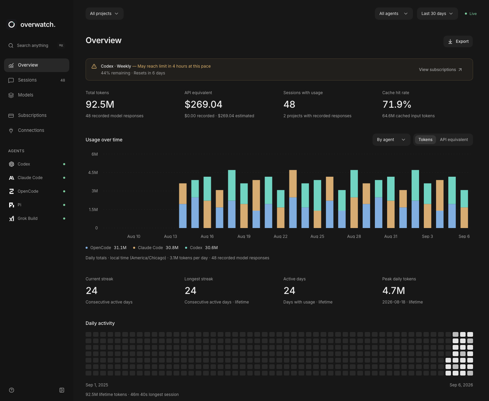
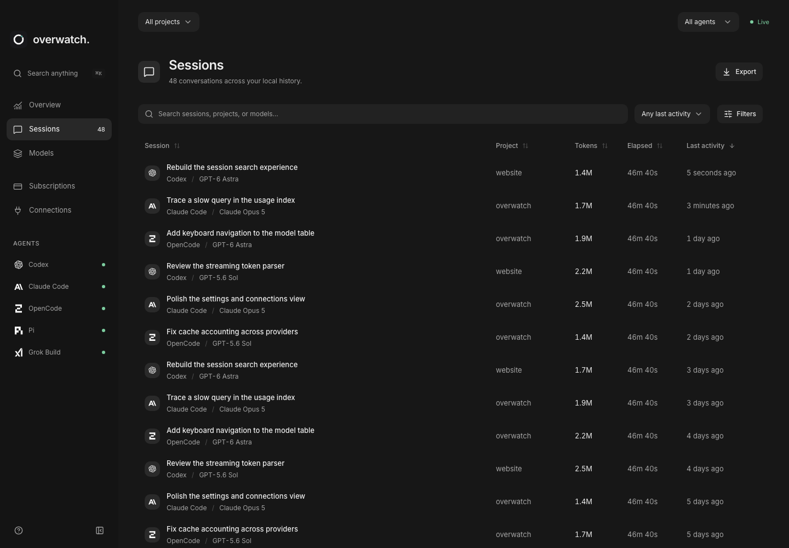
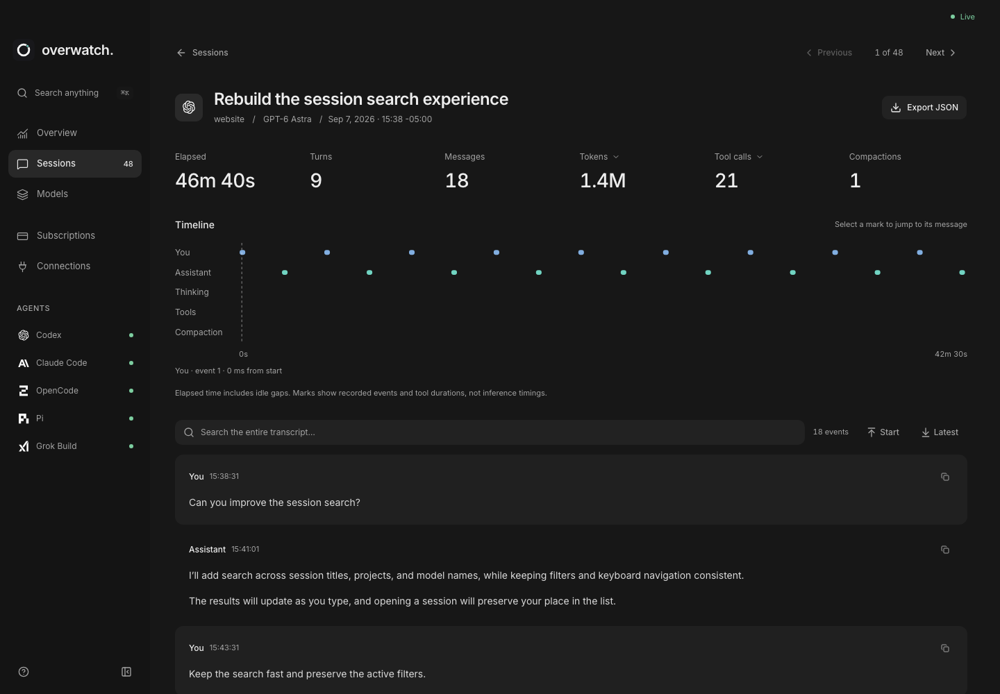
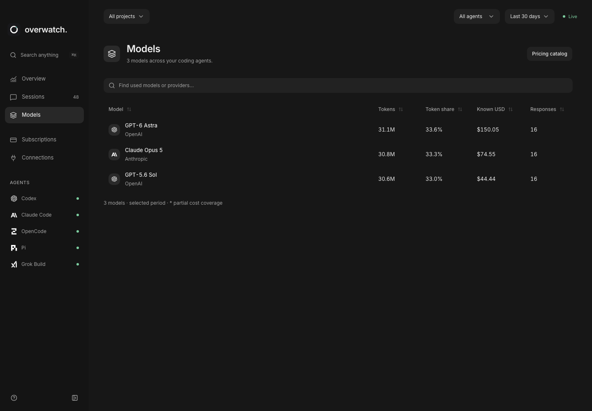
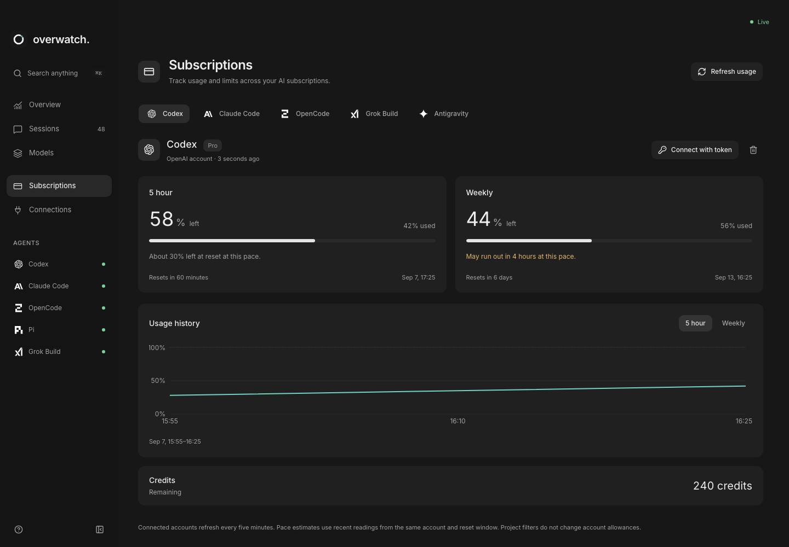
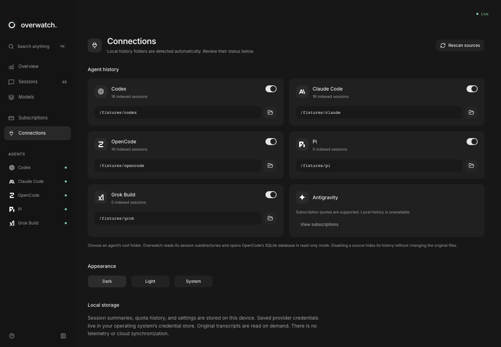

# overwatch

[](https://github.com/joeychilson/overwatch/actions/workflows/ci.yml)
[](LICENSE)

A desktop app for browsing coding-agent sessions, token usage, costs, and subscription allowances. Your histories stay on your machine.

Built for **macOS 13.3+ on Apple Silicon**. Other platforms are not tested or released.

| Overview                                                                                                         | Sessions                                                                                                                      |
| ---------------------------------------------------------------------------------------------------------------- | ----------------------------------------------------------------------------------------------------------------------------- |
| [](.github/images/overview.png) | [](.github/images/session-list.png) |

<details>
<summary>More screenshots</summary>

| Session detail                                                                                                          | Models                                                                                               |
| ----------------------------------------------------------------------------------------------------------------------- | ---------------------------------------------------------------------------------------------------- |
| [](.github/images/sessions.png) | [](.github/images/models.png) |

| Subscriptions                                                                                                                        | Connections                                                                                                          |
| ------------------------------------------------------------------------------------------------------------------------------------ | -------------------------------------------------------------------------------------------------------------------- |
| [](.github/images/subscriptions.png) | [](.github/images/connections.png) |

</details>

_Sample data. Click any screenshot to view it at full size._

## Features

- Search sessions and read transcripts from **Codex, Claude Code, OpenCode, Pi, and Grok Build**.
- Inspect token usage, costs, and tool activity; compare models across providers and agents.
- Track subscription allowances for **Codex, Claude, OpenCode Go, Grok, and Antigravity**.
- Export usage as CSV and transcripts as JSON. Transcript text and tool-output fields are limited to 60 KB each.

Costs use recorded values or estimates from a bundled [models.dev](https://models.dev) catalog, which you can refresh manually. Model versions, variants, and provider pricing stay distinct. Missing prices stay unknown; estimates are not subscription bills.

## Data and privacy

Overwatch reads local histories without modifying or uploading them. Use **Connections** to review detected folders and disable sources you do not want indexed. Transcripts are read from the original files on demand.

Settings, session summaries (including titles and project paths), and allowance history are stored in `~/Library/Application Support/com.joeychilson.overwatch/history.sqlite`. Cached pricing lives beside it.

**Subscriptions** uses an existing provider sign-in or an access token saved in the OS credential store. Allowances refresh about every five minutes, with longer delays after failures. Renew expired sign-ins through the provider; Overwatch does not refresh tokens.

Network access is used for account usage, manual pricing refreshes, and app updates in configured release builds. Links open in your browser.

## Run locally

Install [Vite+](https://viteplus.dev), Node.js 26+, stable Rust, and the
[Tauri prerequisites](https://v2.tauri.app/start/prerequisites/), then run:

```sh
vp install --frozen-lockfile
vp run tauri dev
```

Use `vp dev` for the frontend alone. Reading local histories and connecting accounts require the desktop app.

## Build

```sh
vp run tauri build --bundles app -- --locked
```

The macOS app is written to `src-tauri/target/release/bundle/macos/Overwatch.app`.
Omit `--bundles app` to also build a DMG.

See the [development guide](docs/development.md) for tests and contributor notes, and the [release guide](docs/releases.md) for signing, notarization, and publishing.

## License

[MIT](LICENSE). Model metadata and logo credits are listed in [sources](public/logos/sources.md).
