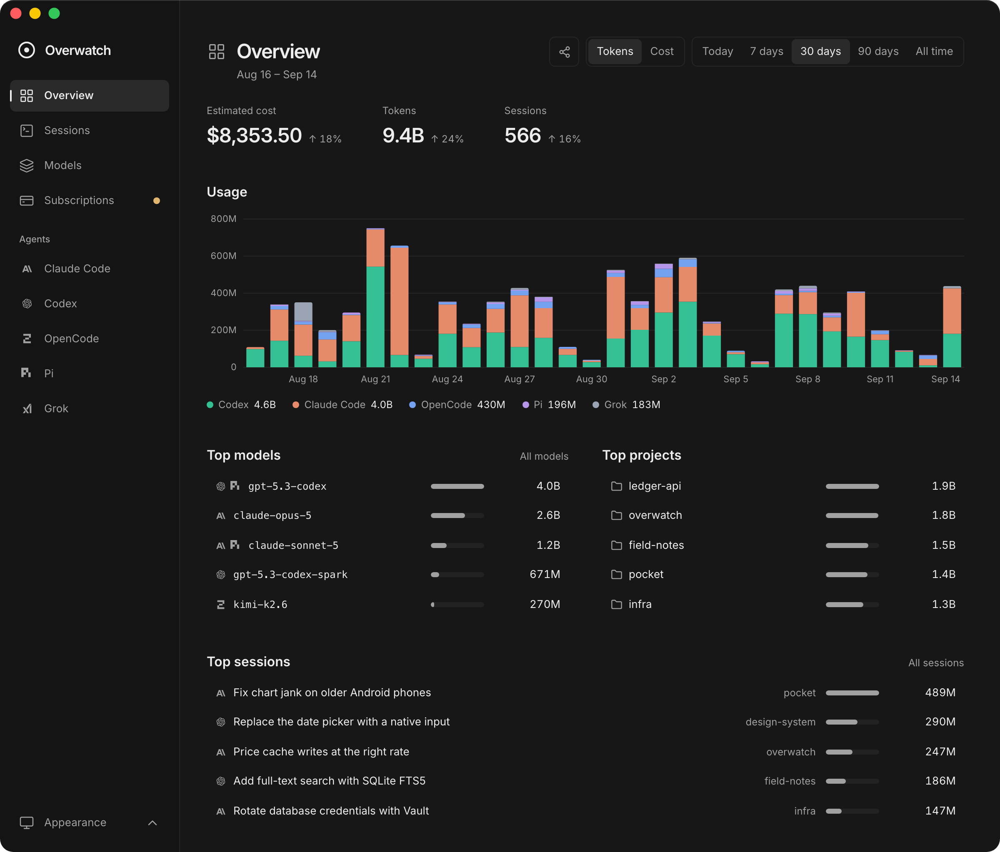
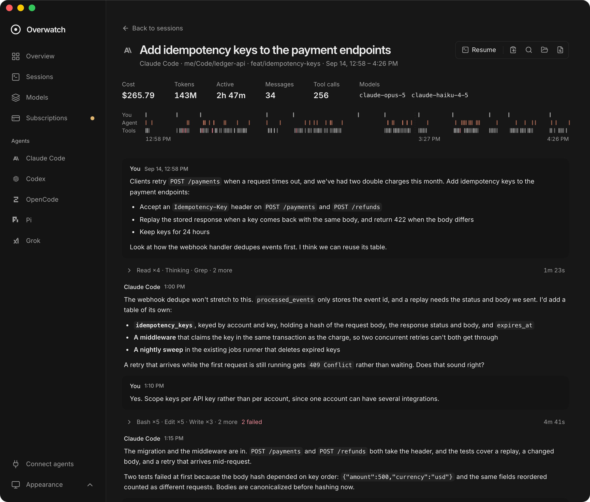
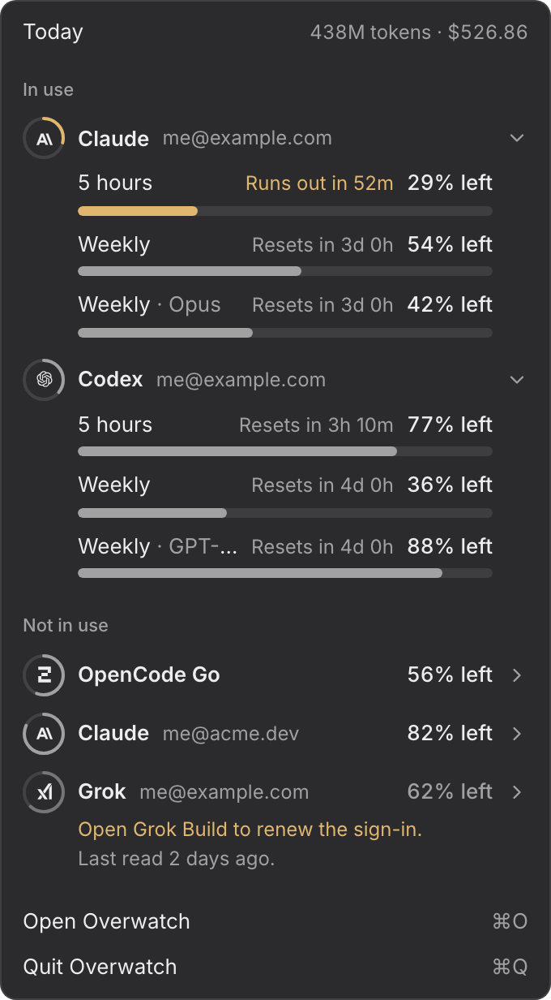

# Overwatch

A macOS app for your coding-agent history: sessions, token usage, cost, and subscription limits.

It reads what **Claude Code, Codex, OpenCode, Pi, and Grok Build** already keep on your Mac. No setup, no account, no telemetry.

<p align="center">
  
  
</p>

## Features



- **Overview**: tokens and cost by agent, plus the top models, projects, and sessions. Today is drawn by the hour.
- **Share**: any period as a card — your top models and agents side by side — saved to your Desktop as a PNG.
- **Sessions**: search every session by its title or by what was said in it, and read it as a conversation with a timeline of turns and tool calls. One still going fills in as its agent works. Find within one with ⌘F, and copy a message, a block of code, a tool's output, or the whole conversation as Markdown.
- **Models**: usage, cost, and trend for each model.
- **Subscriptions**: what's left of your Claude, Codex, Grok, and OpenCode Go limits, with a notification before one runs out.
- **Menu bar**: your tightest limit at a glance, and what today has used. Close the window and it leaves the Dock but keeps watching from the menu bar.
- **Agents**: connect Claude Code, Codex, OpenCode, Grok Build, or any other MCP client, and it can find, sum up, and read your sessions from every agent, search what was said in them, total usage and cost any way it needs, and pace itself against your limits — "work on this, but stop when the 5-hour limit reaches 50%". **Connect agents** in the sidebar gives the command to run.

New sessions show up within seconds while you work.

## Supported agents

| Agent       | Reads from                                          |
| ----------- | --------------------------------------------------- |
| Claude Code | `~/.claude/projects/`                               |
| Codex       | `~/.codex/sessions/`, `~/.codex/archived_sessions/` |
| OpenCode    | `~/.local/share/opencode/opencode.db`               |
| Pi          | `~/.pi/agent/sessions/`                             |
| Grok Build  | `~/.grok/sessions/`                                 |

An agent appears once its directory exists. [docs/agents.md](docs/agents.md) covers what each one records.

## Privacy

- **Read-only.** Agent files and sign-ins are never modified or renewed.
- **No transcript copies.** The index holds summaries and usage counts; conversations are read from the agent's files when you open them or search what was said in them.
- **One kind of network request.** Each subscription's usage endpoint, using the sign-ins your agents already have (including Claude Code's Keychain item).
- **No telemetry.**
- **Agents you connect read what you can.** Their MCP server only reads, makes no network requests, and answers from the same index, so a connected agent sees your sessions and what was said in them, and sends what it reads to its own model provider, as it does anything else it reads.

[docs/architecture.md](docs/architecture.md) lists exactly what is read and where requests go.

## Good to know

- Cost is an estimate at [models.dev](https://models.dev) list prices, not what your subscription charged. Grok is the exception: xAI reports the real charge.
- Usage with no known price shows `—`, not `$0.00`.
- The usage endpoints are undocumented and may change.

## Install

Requires macOS 13.3 or later. Universal: Apple silicon and Intel.

```sh
brew install --cask joeychilson/tap/overwatch
```

Or take the disk image from the [latest release](https://github.com/joeychilson/overwatch/releases/latest).

Overwatch is not notarized — Apple charges a yearly fee for that — so macOS stops it the first time it is opened, however it arrived. Open **System Settings → Privacy & Security**, scroll to the bottom, and choose **Open Anyway**. Homebrew quarantines every cask and removed `--no-quarantine` in 2026, so this holds for the disk image and for Homebrew alike.

[mise](https://mise.jdx.dev) fetches the same cask without Homebrew and sets no quarantine flag, so what it installs opens straight away:

```sh
mise bootstrap packages brew tap joeychilson/tap
mise bootstrap packages use brew-cask:joeychilson/tap/overwatch
```

## Building it yourself

Requires [Vite+](https://viteplus.dev/guide/) and the [Tauri prerequisites](https://v2.tauri.app/start/prerequisites/). Use the Node version in `.node-version`; rustup picks up `rust-toolchain.toml`.

```sh
git clone https://github.com/joeychilson/overwatch.git
cd overwatch
vp install --frozen-lockfile
vp exec vp run desktop:build
open src-tauri/target/release/bundle/macos/Overwatch.app
```

Local builds are not signed or notarized.

## Development

```sh
vp exec vp run desktop   # desktop app
vp exec vp run dev       # browser only, on port 1430
vp exec vp run demo      # browser only, filled with sample data
```

Always go through `vp exec vp` to use the project's own Vite+.

| Command                        | Purpose                                 |
| ------------------------------ | --------------------------------------- |
| `vp exec vp run check`         | Svelte, formatting, lint, and types     |
| `vp exec vp run check:rust`    | Rust formatting, Clippy, and tests      |
| `vp exec vp run test:unit`     | Unit tests                              |
| `vp exec vp run test`          | Unit tests, then browser tests          |
| `vp exec vp run fmt`           | Format frontend and Rust code           |
| `vp exec vp run build`         | Check and build the frontend            |
| `vp exec vp run desktop:build` | Build the macOS app                     |
| `vp exec vp run dmg:build`     | Build the universal disk image          |
| `vp exec vp run screenshot`    | Render the screenshots from sample data |
| `vp exec vp run record`        | Record a walk through the app           |

- Install test browsers once: `vp exec playwright install chromium webkit`.
- `demo` answers every engine command from `scripts/sample/`, so the pages can be walked through without a machine's own history behind them. `record` walks them by itself and writes the walk to `.github/assets/overwatch-tour.webm`.
- Browser tests can't cover window controls or dragging. Check those in the desktop app.
- The types in `src/lib/api/backend.ts` are hand-written copies of `src-tauri/src/session.rs`. Change both together.
- SvelteKit is a 3.0 prerelease. Use the [SvelteKit 3 docs](https://next.svelte.dev/docs/kit).
- To benchmark against your own history, run `cargo run --release --example scan` in `src-tauri/`. It's read-only and indexes into a temp directory.

Conventions and commit format are in [AGENTS.md](AGENTS.md). How the engine works is in [docs/](docs/README.md).

## Credits

Prices from [models.dev](https://github.com/sst/models.dev) (MIT). Font is [Inter](https://github.com/rsms/inter) (OFL 1.1). Agent and provider names and marks belong to their owners. Overwatch isn't affiliated with or endorsed by any of them.

## License

[MIT](LICENSE)
