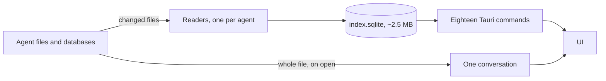

# Overwatch engine

Overwatch is a desktop app for exploring the coding-agent sessions on this
computer: the conversations, tool calls, reasoning, token usage, costs, and
subscription limits of **Claude Code, Codex, OpenCode, Pi, and Grok**.

Its Rust engine reads the agents' own files read-only, keeps a small index of
what it found, and answers eighteen Tauri commands. Its only network traffic is
reading subscription limits from your own providers, with the sign-ins your
agents already keep.

## The documents

| Document                        | What it explains                                                               |
| ------------------------------- | ------------------------------------------------------------------------------ |
| [Architecture](architecture.md) | How the engine works, why it is fast, what is stored, and the measured numbers |
| [Agents](agents.md)             | Where each agent keeps its history, what it records, and what it does not      |
| [API](api.md)                   | The command surface, the wire types, and the conventions they follow           |

Repository conventions, checks, and the commit format are in
[AGENTS.md](../AGENTS.md).

## The shape of it

A scan reads the files that changed since the last one and counts every usage
record in them under the quarter hour it happened in, so a period or a day shows
only what was used within it. A conversation is read from its file when it is
opened, one session at a time; no transcript text is copied into the database.

## Principles

1. **The agents' files are the database.** The index holds summaries, usage by
   quarter hour, and file signatures; transcripts are read from the source on
   demand. It is a cache, so it has no migrations — a schema change rebuilds it
   in a few seconds.
2. **Recorded, except cost.** Tokens are the agent's own counts, each counted
   once, using each record's own total rather than a sum of parts, because
   agents differ on what their parts include. Cost is the one estimate: most
   agents record none, so usage is priced at the list prices in the models.dev
   catalog, unless the agent reports what was actually charged, as Grok does.
3. **Null means unknown, not zero.** Usage with no listed price reads as `—`.
   Presenting that as `$0.00` would say it was free.
4. **One unreadable file costs that file.** It is skipped and listed under a
   warning in the sidebar; it never stops a scan.
5. **History outlives its source.** A session whose file disappears stays in
   the index, flagged, rather than vanishing silently.
6. **Browsing never waits.** The window opens immediately, indexing runs in the
   background newest first while the window fills in as it goes, and every
   query is indexed.
7. **Nothing leaves the machine but limit checks.** The only requests go to
   your own providers' usage endpoints, with sign-ins the agents keep. No
   telemetry.

## Out of scope

The engine does not execute or control agents, resume sessions, change or
renew providers' sign-ins, purchase credits, import archives, synchronize to
the cloud, or generate model judgments about transcripts.
